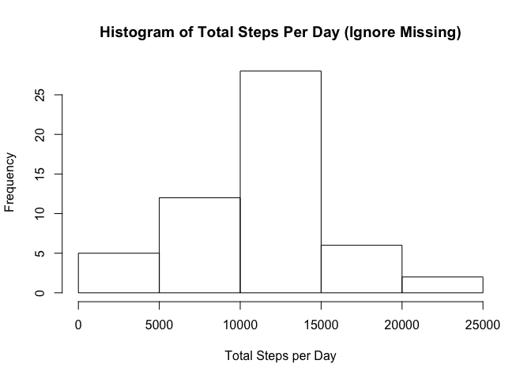
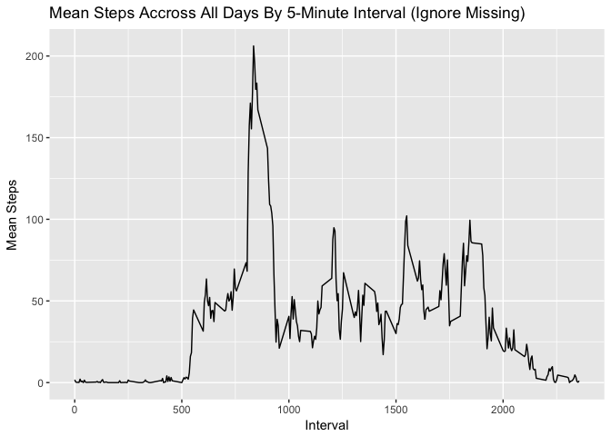
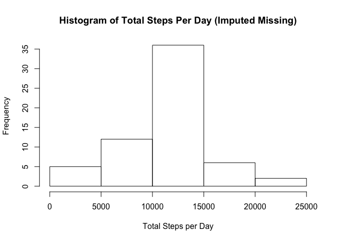
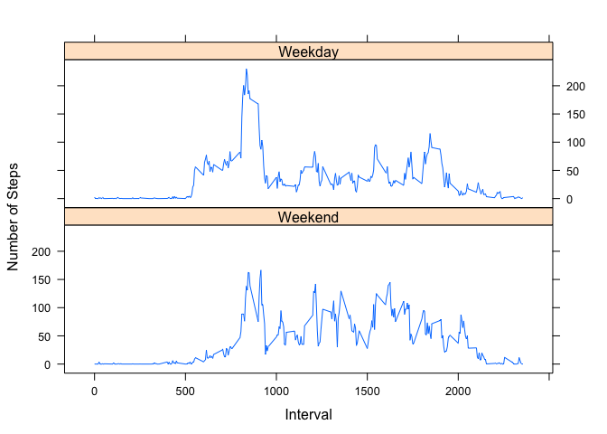

### Housekeeping


```r
library(dplyr)
```

```
## 
## Attaching package: 'dplyr'
```

```
## The following objects are masked from 'package:stats':
## 
##     filter, lag
```

```
## The following objects are masked from 'package:base':
## 
##     intersect, setdiff, setequal, union
```

```r
library(ggplot2)
library(lattice)

path <- "/Coursera/Personal Activity Monitoring"
```

### Download and prepare file


```r
if (!file.exists(path)){
  dir.create(path)
}
setwd(path)

if (!file.exists("activity.zip")){
  URL <- "https://d396qusza40orc.cloudfront.net/repdata%2Fdata%2Factivity.zip"
  download.file(URL, destfile = "activity.zip", method = "curl")
  unzip("activity.zip", exdir = ".")
}
```

### Load CSV data file and show data summary


```r
dataActivity <- read.csv("activity.csv")
names(dataActivity)
```

```
## [1] "steps"    "date"     "interval"
```

```r
summary(dataActivity)
```

```
##      steps                date          interval     
##  Min.   :  0.00   2012-10-01:  288   Min.   :   0.0  
##  1st Qu.:  0.00   2012-10-02:  288   1st Qu.: 588.8  
##  Median :  0.00   2012-10-03:  288   Median :1177.5  
##  Mean   : 37.38   2012-10-04:  288   Mean   :1177.5  
##  3rd Qu.: 12.00   2012-10-05:  288   3rd Qu.:1766.2  
##  Max.   :806.00   2012-10-06:  288   Max.   :2355.0  
##  NA's   :2304     (Other)   :15840
```

### Histogram of total steps per day


```r
dataHist <- filter( dataActivity, steps >= 0) %>%
                    group_by(date) %>%
                    summarize(steps = sum(steps))

hist(dataHist$steps,
     main = "Histogram of Total Steps Per Day (Ignore Missing)",
     xlab = "Total Steps per Day")
```

<!-- -->

### Print Mean and Median of total steps per day


```r
meanSteps1 <- mean(dataHist$steps)
medianSteps1 <- median(dataHist$steps)

print(meanSteps1)
```

```
## [1] 10766.19
```

```r
print(medianSteps1)
```

```
## [1] 10765
```

### What is the average daily activity pattern of the average number of steps taken, averaged across all days?


```r
dataTS <- filter( dataActivity, steps >= 0) %>%
                  group_by(interval) %>%
                  summarize(steps = mean(steps))

qplot(x= dataTS$interval, y= dataTS$steps,
       data = dataTS,
       geom = c("line"), 
       xlab = "Interval", 
       ylab = "Mean Steps", 
       main = "Mean Steps Accross All Days By 5-Minute Interval (Ignore Missing)")
```

<!-- -->

### Which 5-minute interval, on average across all the days in the dataset, contains the maximum number of steps?


```r
dataTS[which.max(dataTS$steps), ]
```

```
## # A tibble: 1 x 2
##   interval steps
##      <int> <dbl>
## 1      835   206
```

### Calculate and report the total number of missing values in the dataset (i.e. the total number of rows with 𝙽𝙰s)


```r
dataMissing <- is.na(dataActivity$steps)
table(dataMissing)
```

```
## dataMissing
## FALSE  TRUE 
## 15264  2304
```

### Create a new dataset an fill all of the missing values in the dataset with the mean for that 5-minute interval


```r
fill.steps <- function (steps, interval) {
  fillSteps <- NA
  if (is.na(steps))
    fillSteps <- (dataTS[dataTS$interval == interval, "steps"]) else fillSteps <- c(steps)
  return(fillSteps)
}

dataFilled <- dataActivity
dataFilled$steps <- as.integer(mapply(fill.steps, dataFilled$steps, dataFilled$interval))
```

### Make a histogram of the total number of steps taken each day
Calculate and report the mean and median total number of steps taken per day. Do these values differ from the estimates from the first part of the assignment? What is the impact of imputing missing data on the estimates of the total daily number of steps?


```r
dataHistFilled <- filter( dataFilled, steps >= 0) %>%
                          group_by(date) %>%
                          summarize(steps = sum(steps))

hist(dataHistFilled$steps,
     main = "Histogram of Total Steps Per Day (Imputed Missing)",
     xlab = "Total Steps per Day")
```

<!-- -->

### Print Mean and Median of total steps per day (imputed missing)


```r
meanSteps2 <- mean(dataHist$steps)
medianSteps2 <- median(dataHist$steps)

print(meanSteps2)
```

```
## [1] 10766.19
```

```r
print(medianSteps2)
```

```
## [1] 10765
```

### Are there differences in activity patterns between weekdays and weekends?


```r
dataFilled$day <- factor((weekdays(as.Date(dataFilled$date)) %in% 
                               c('Monday', 'Tuesday', 'Wednesday', 'Thursday', 'Friday')), 
                               levels = c(FALSE, TRUE), labels = c('Weekend', 'Weekday'))

dataFilledSum <- group_by( dataFilled, interval, day) %>%
                         summarize(meanSteps = mean(steps))

xyplot(meanSteps~interval|(day),
       data = dataFilledSum,
       type="l",
       layout=c(1,2),
       xlab = "Interval",
       ylab = "Number of Steps")
```

<!-- -->
